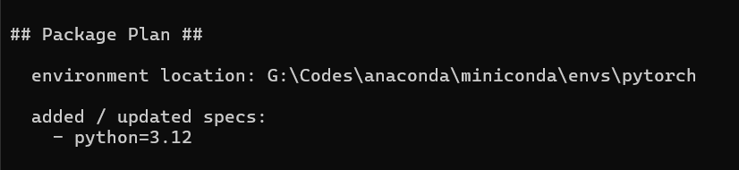
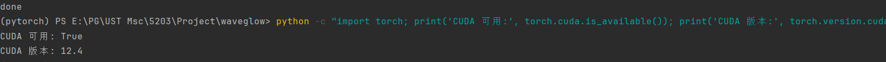

# ARIN5203 Project Glow-tts

# Milestone: Yang Fengshuo

## Update: 2025.10.19

### 1. Reference Documentation

1. [语音识别 课程（中文版）](https://interactiveuandmetutorials.weebly.com/35486388993567221029-3550631243.html)

2. **Text-to-Speech Synthesis**, PAUL TAYLOR (University of Cambridge)

### 2. Environment Setup

(Anaconda Python Environment is recommanded)
1. Python environment



2. Install a version of PyTorch that supports CUDA 12.4
```bash
conda install pytorch torchvision torchaudio pytorch-cuda=12.4 -c pytorch -c nvidia
```

3. Install other dependencies and APEX required by WaveGlow
```bash
pip install librosa soundfile numpy scipy
pip install matplotlib tensorboard
pip install tqdm pillow

# Clone APEX and Compile 
git clone https://github.com/NVIDIA/apex
cd apex

pip install -v --disable-pip-version-check --no-cache-dir --global-option="--cpp_ext" --global-option="--cuda_ext" ./
```
4. Prepare WaveGlow source code and pre-trained model
```bash
git clone https://github.com/NVIDIA/WaveGlow.git
```

### 3. Next steps: Run inference or training(projected in next week)
1. Generate Mel-spectrogram using TTS model
2. Mel-spectrum Inference Generation Language
```bash
python inference.py -f <Mel_file> -w <Pre_model_file> -o <Output> --cuda
```
3. Training Evolution
Prepare LJSpeech dataset
---
